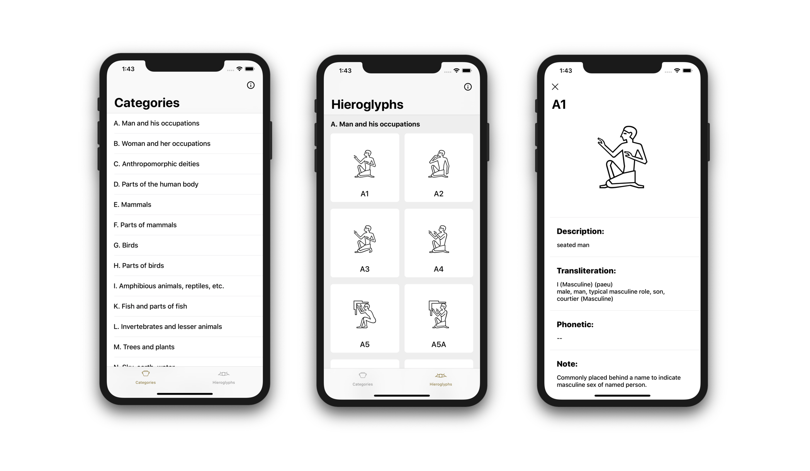

# Gardiner's Memo

Gardiner's Sign List is a list of common Egyptian hieroglyphs compiled by Sir Alan Gardiner. It is considered a standard reference in the study of Ancient Egyptian hieroglyphs.

The Gardiner's Memo app compiles the hieroglyphs into easy to navigate categories with information and images.

## Contribution

This application and the data used are open source.

The data used in the application are created using this other [repository](https://github.com/florianldt/HieroglyphsScraper).

If you are interested to contribute for the application, do not hesitate.

The hieroglyphs information gathered from Wikipedia are also not complete. If you are confortable enough with the egyptian hieroglyphs to improve the app, it would be awesome.

Any contribution is welcome.

## Contact

If you are willing to contact me, you can either create a issue here or find me on [florianldt.com](http://florianldt.com). My DMs are also open on Twitter ([@florianldt](https://twitter.com/florianldt)).
